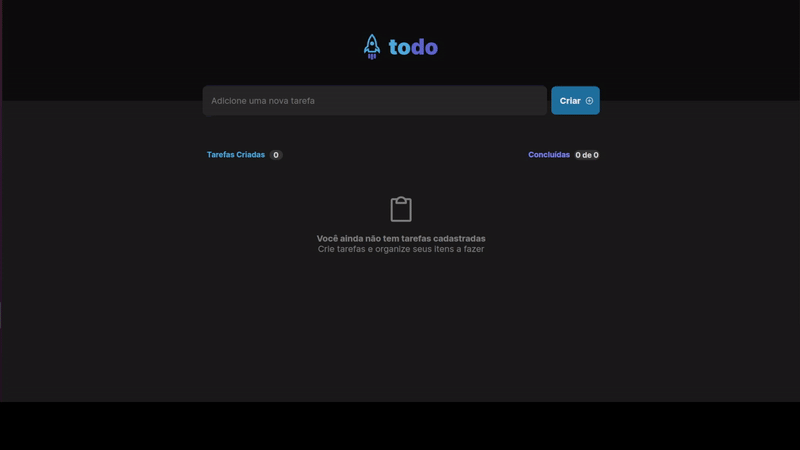
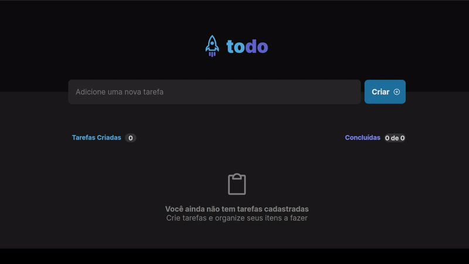

# <h1 align="center"> </h1>

Todo-List

Aplicação de controle de tarefas no estilo **to-do list**, desenvolvida na Trilha ReactJS com TypeScript do curso Ignite/Rocketseat.

Funcionalidades:

- Adicionar uma nova tarefa
- Marcar e desmarcar uma tarefa como concluída
- Remover uma tarefa da listagem
- Mostrar o progresso de conclusão das tarefas
  

  

  

